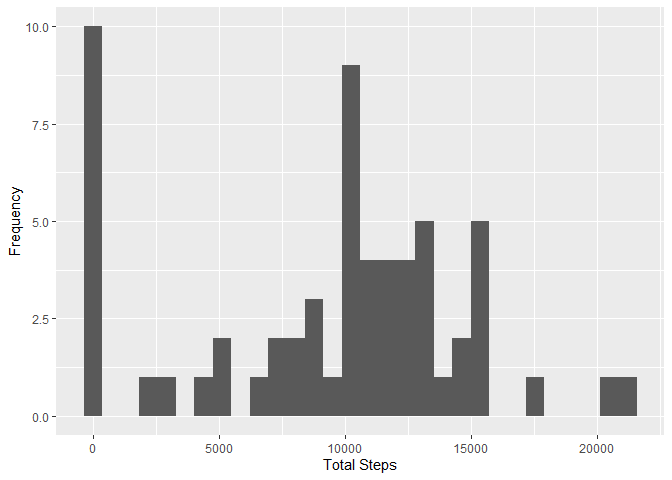
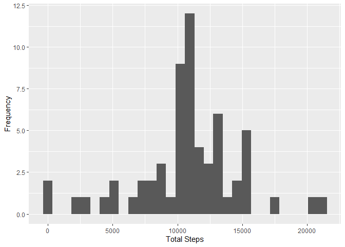
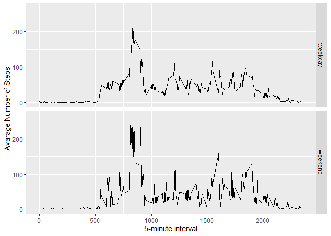

---
title: "Reproducible Research: Peer Assessment 1"
output: 
  html_document:
    keep_md: true
---


```r
#loading libs to manipulate and display the data
library(dplyr)
library(ggplot2)
```
<br>

## Loading and preprocessing the data


```r
## Data Exploration via Excel
## Create the necessary data sets to report out the questions


df <- read.csv("activity.csv", header = TRUE, colClasses = c("integer", "Date", "integer"))
```

<br>

## What is mean total number of steps taken per day?


```r
dailySteps <- df %>% select(date, steps) %>% 
  
  group_by(date) %>% summarise(totalSteps = sum(steps, na.rm = TRUE))

## Have to remove NA's otherwise result is NA
dStepsMean <- mean(dailySteps$totalSteps, na.rm = TRUE)
dStepsMedian <- median(dailySteps$totalSteps, na.rm = TRUE)
```
<br>

# 
## What is mean total number of steps taken per day?

<br>

*Plot - Total Steps per Day*


```r
ggplot(data = dailySteps, aes(x = totalSteps)) +
  geom_histogram() +
  labs(x = "Total Steps", y="Frequency")
```

<!-- -->
<br>

##### The mean is 9354.230 .

##### The median is 10395 .


<br>
<br>

  

## What is the average daily activity pattern?


```r
# Calculate average steps per interval
avgSteps <- df %>% select(date, steps, interval) %>% 
  group_by(interval) %>% summarise(avgSteps = mean(steps, na.rm = TRUE))

ggplot(avgSteps, aes(x=interval, y=avgSteps)) +
    geom_line() +
    xlab("5-minute interval") +
    ylab("average number of steps taken") 
```

<!-- -->

```r
maxInterval <- avgSteps$interval[which.max(avgSteps$avgSteps)]
```

##### The interval with the greats number of stes on average is 835 .

<br>
<br>

## Imputing missing values

<br>


```r
#Simply get the sum of row with NAs

nbrNAs <- sum(is.na(df$steps))

#Create a new dataframe

dfMeanNA <- df

# I am sure there is a fancier way. But apply, impute, dply mutate/case are a bit advanced. 
for (i in 1:nrow(dfMeanNA)){
  if(is.na(dfMeanNA$steps[i])){
    dfMeanNA$steps[i]<- avgSteps$avgSteps[dfMeanNA$interval[i] == avgSteps$interval]
  }
}

dailyStepsNoNAs <- dfMeanNA %>% select(date, steps, interval) %>% 
  
  group_by(date) %>% summarise(totalSteps = sum(steps))

ggplot(data = dailyStepsNoNAs, aes(x = totalSteps)) +
  geom_histogram() +
  labs(x = "Total Steps", y="Frequency")
```

<!-- -->

```r
dStepsMeanNoNAs <- mean(dailyStepsNoNAs$totalSteps)
dStepsMedianNoNAs <- median(dailyStepsNoNAs$totalSteps)
```

##### The number of missing values in the Interval colum is 2304 .

##### The mean is 10766.189 .

##### The median is 10766.189 .

<br>

##### THe difference between pre NA row removal and post were no NAs were removed but imputed. Is as follows:

##### Pre Impute Mean: 9354.230.
##### Post Impute Mean:10766.189.

<br>

##### Pre Impute Median: 10395.
##### Post Impute Median:10766.189.

<br>

##### The mean and median increased after the impute operation. 

<br>

<br>

## Are there differences in activity patterns between weekdays and weekends?

```r
# Create factor variable for plotting and aggregate the data. 

dfMeanNA$day <- ifelse(weekdays(dailyStepsNoNAs$date) %in% c("Saturday", "Sunday"), "weekend", "weekday")


avgDailyStepsByDoW <- aggregate(steps ~ interval + day, data=dfMeanNA, mean)

ggplot(avgDailyStepsByDoW, aes(interval, steps)) + 
    geom_line() + 
    facet_grid(day ~ .) +
    xlab("5-minute interval") + 
    ylab("Avarage Number of Steps")
```

<!-- -->


<br>

##### I expected an increase in steps during the weekday. But this could indcate
##### inidividuals that wear smart devices are dedicated to walking and will
##### use the free time during the weekend mornings to get their steps in.

<br>

